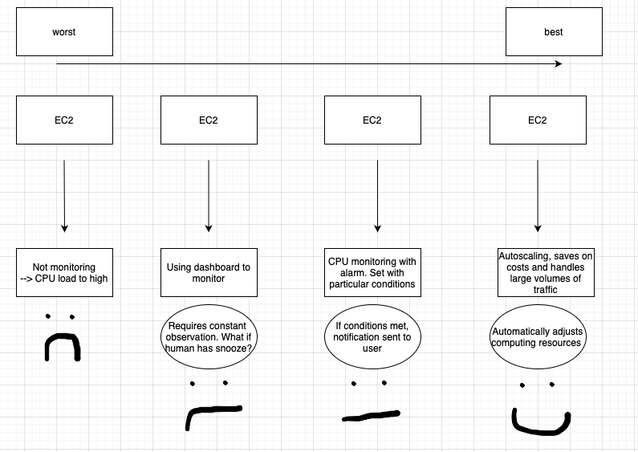
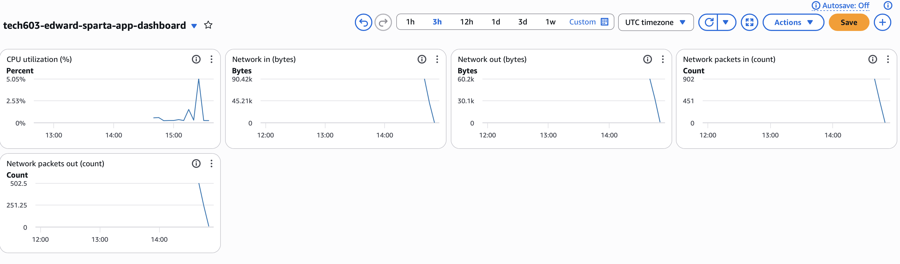
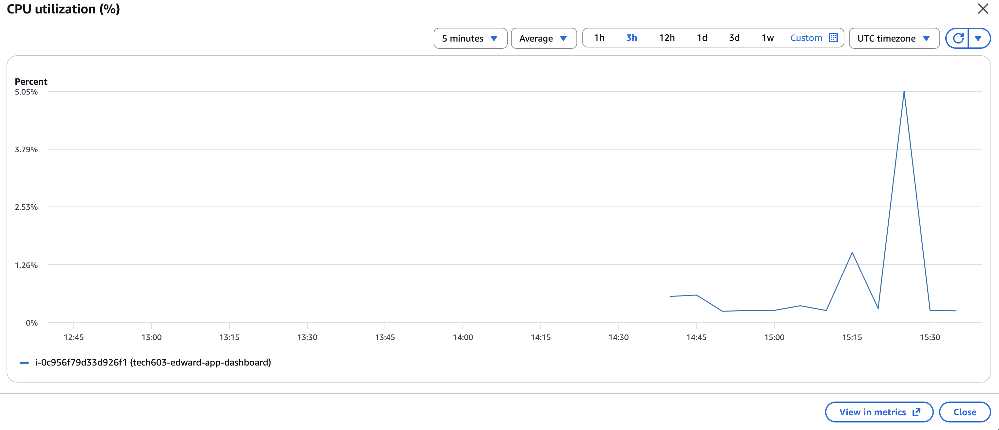
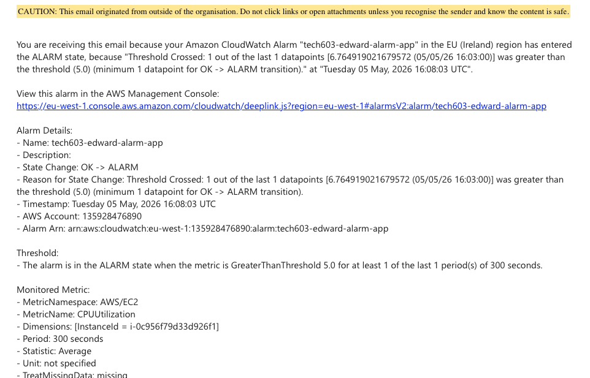
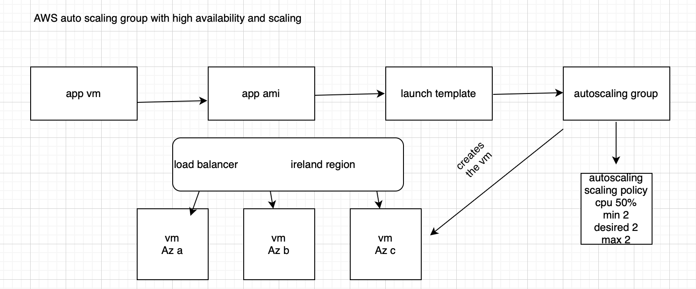
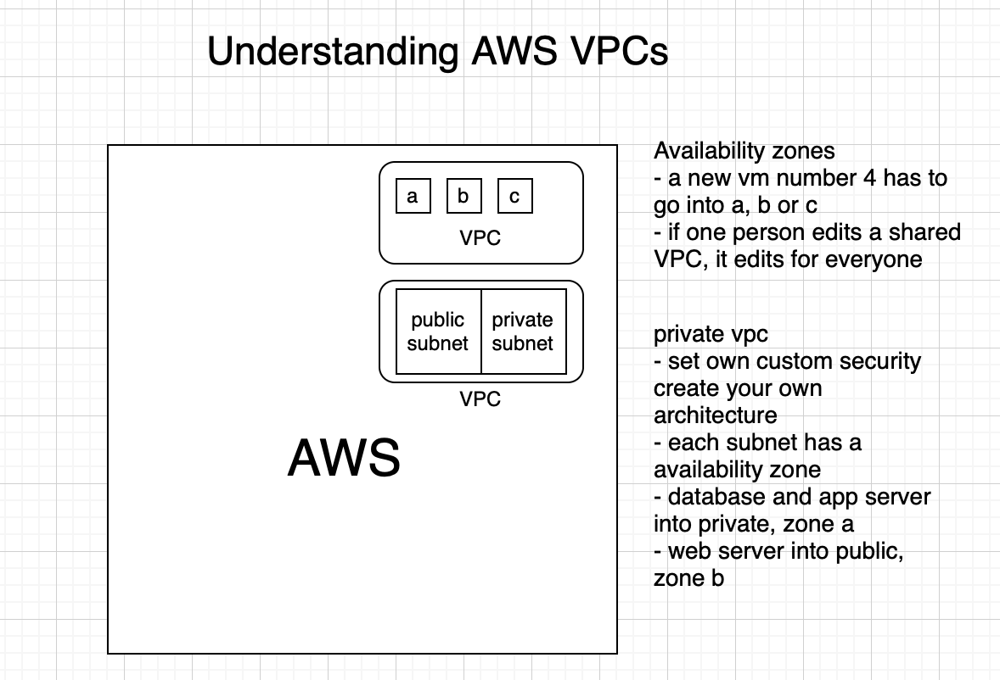
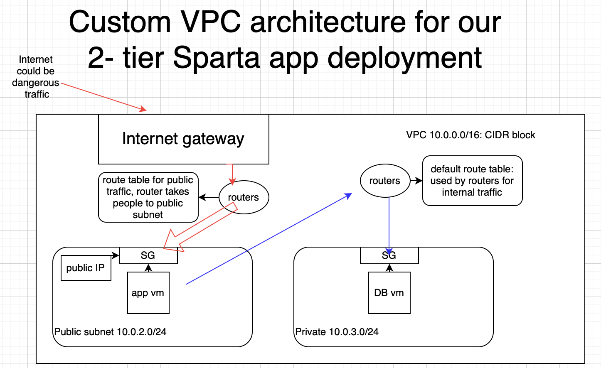
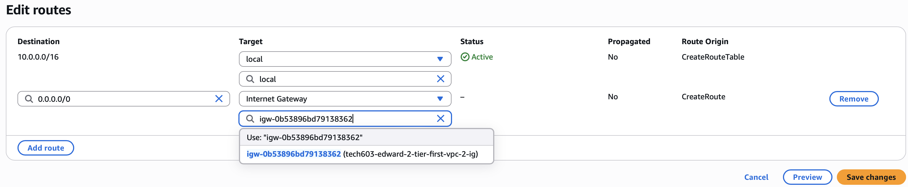
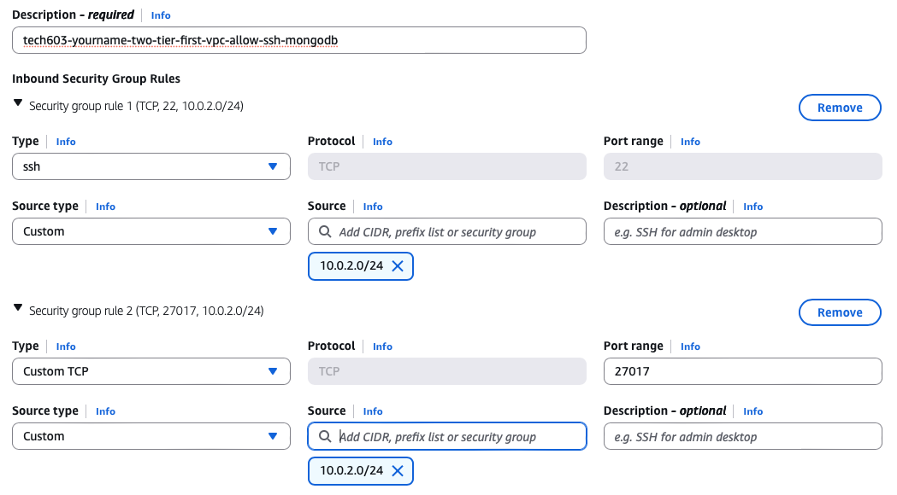
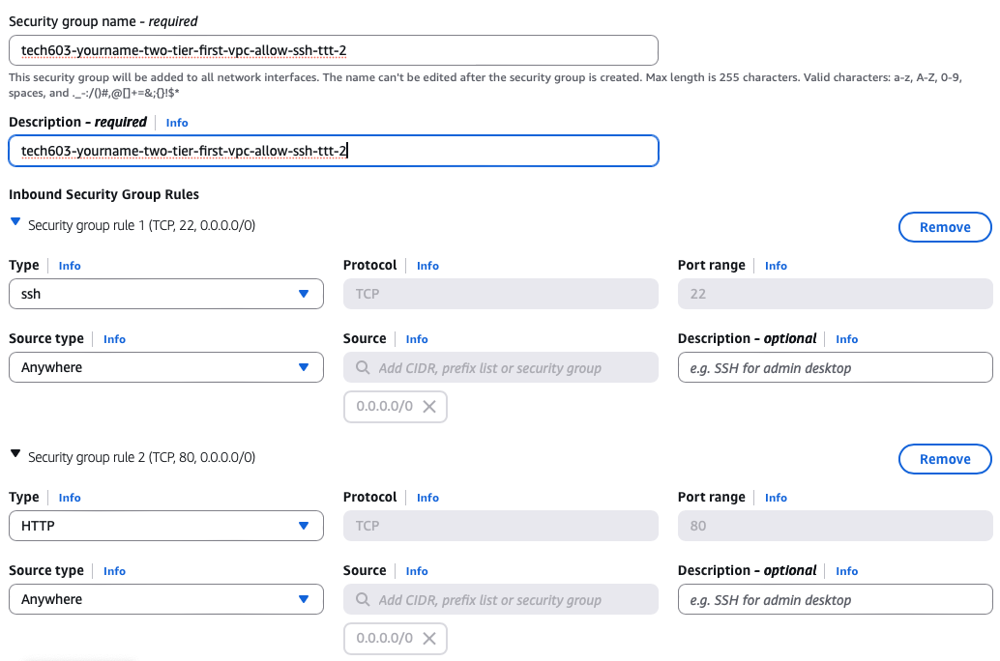

## monitoring, alarm management and autoscaling

- [monitoring, alarm management and autoscaling](#monitoring-alarm-management-and-autoscaling)
- [what is better than monitoring?](#what-is-better-than-monitoring)
  - [what is worse](#what-is-worse)
  - [what is better](#what-is-better)
  - [Better than a dashboard](#better-than-a-dashboard)
  - [how to load a dashboard](#how-to-load-a-dashboard)
  - [different types of testing](#different-types-of-testing)
- [apache bench](#apache-bench)
- [creating a GPU usage alarm](#creating-a-gpu-usage-alarm)
- [types of scaling](#types-of-scaling)
- [autoscaling architecture](#autoscaling-architecture)
- [launching an asg\\](#launching-an-asg)
  - [step 1:](#step-1)
  - [step 2:](#step-2)
  - [step 3:](#step-3)
  - [step 4:](#step-4)
  - [step 5:](#step-5)
- [What are AWS VPCs](#what-are-aws-vpcs)
- [Custom VPC architecture fpr pur 2- tier sparta app deployment](#custom-vpc-architecture-fpr-pur-2--tier-sparta-app-deployment)
  - [CIDR block](#cidr-block)
  - [bastion server](#bastion-server)
  - [usual VPC setup with a bastion](#usual-vpc-setup-with-a-bastion)
  - [what order d oyou make it](#what-order-d-oyou-make-it)
- [setting up a vpc](#setting-up-a-vpc)
  - [step 1: **setting up the vpc**](#step-1-setting-up-the-vpc)
  - [step 2: **create subnets**](#step-2-create-subnets)
  - [step 3: **create internet gateway**](#step-3-create-internet-gateway)
  - [step 4: **create route table**](#step-4-create-route-table)
  - [step 5: **launch db instance with vpc security configurations**](#step-5-launch-db-instance-with-vpc-security-configurations)
  - [step 6: **launch app instance with vpc security configurations**](#step-6-launch-app-instance-with-vpc-security-configurations)


## what is better than monitoring?
- what is better than monitoring
  - the systematic, continuous process of watching, checking and recording data or situations over time to assess progress or detect changes
  - provides info about applications performance and usage
### what is worse
- not monitoring
- not watching cpu so its too high can cause app to crash

### what is better
- cloud watch monitoring
- watches CPU load, CPU utilisation provides at intervals to see big picture
- create a dashboard to show usage 
  - cons: very comples, overwhelming volume of info, constant monitoring required



### Better than a dashboard
- set up an alarm
- provides notification if cpu usage is too high
- even better if there is autoscaling, if the load isnt so high then less instances of the app
- usually platform for a service provides this for you

### how to load a dashboard
1. go to running app instance and scroll down to monitoring
2. press manage detailed monitoring, enable and confirm (detail monitoring has extra charges)
3. press three dots to add to dashboard and create a new one and add dashboard
- once the dashboard is created:
  - delete graphs with data that is not needed (CPU credit balance, CPU credit usage, metadata)
  - expand certain graphs to improve visualisation
  - edit time scales (1 minute, 5 minutes) to see CPU utilisation over different time scales (can not view below 1 minutes as measurements taken every minute)




### different types of testing
1. load testing (load/manual)
  - test if the app can handle many requests over time
2. stress testing
  - create system pressure
  - use sudo apt-get update -y & sudo apt-get upgrade -y to test
3. using apache

<br>




- first peak is load testing
- second peak is stress testing
- final peak is using apache


## apache bench

- command line tool used to test performance of web servers
- it measures:
  - how fast server responds to http requests
  - how many it can handle
  - when it starts to slow down
- simulates many users accessing the web server
- can be used to test cpu utilization

Format for ab command

```
sudo apt-get install apache2-utils
ab -n 1000 -c 100 http://34.244.178.140/
```
- install the package
- '-n' : number of requests (1000 requests)
- '-c' : make 100 requests at a time
- ends with server being tested

## creating a GPU usage alarm

- follow this link for help
  - https://docs.aws.amazon.com/AmazonCloudWatch/latest/monitoring/US_AlarmAtThresholdEC2.html

1. create an alarm and choose the ec2 metrics
2. find the instanceid of your instance and select the row with cpu utilization
3. choose a period of 1 minute for a quicker alarm activation in the specify metric and conditions tab
4. for whenever cpuutilization tab, choose a suitable threshold that can be activated by testing
5. press next and then create a new sns topic that includes your email so you recieve a notifcation
6. enter your name for the next part and then next and finally preview it, and then create it
- once you test your app servers and reach above the threshold, you will recieve an email like so




## types of scaling


## autoscaling architecture



- internet traffic comes in
- hits load balancer
  - ensures no single vm is overwhelmed
  - improves fault tolerance, if one fails traffic is redirected
- distributes traffic across multiple VMs in different availability zones
  - provides high availability
  - terminates and launches VMs when needed
- ASG manages the number of VMs running following the scaling policy
  - if CPU > 50% then scale out and vice versa 

## launching an asg\
- define the template

### step 1:
- choose the template with your app on
- give appropirate name

### step 2:
- select all three availability zones 
- select the balanced best effort

### step 3: 
- attach a new balancer loader when selecting load balancing options
  - application load balancer for http requests 
  - give appropriate name
  - choose internet facing
  - make sure port 80 is selected and create new target group
- health checks
  - choosse turn on elastic load balancing and give reasonable health check grace period: 90 seconds

### step 4:
- make sure desired capacity and minimum desired capacity is 2
- max desired capacity is 3
- automatic scaling: choose target tracking scaling policy
  - use instance warmup with 90 second

### step 5: 
- add a tag with a name and give the instances names (in value box)
- create the security group, move to integrations and go to the load balancing group
- then click the load balancer, copy the dns name and paste into search bar for app to load

## What are AWS VPCs



## Custom VPC architecture fpr pur 2- tier sparta app deployment


- red lines: possible dangerous traffic entering vpc from internet
- blues lines: safe transferr of traffic accessing DB VM

### CIDR block

- 10.0.0.0
  - 4 segments 
  - 8- bits
  - range 0 - 256 for each segment
  - use this to identify different devices on a network
  - ports are a particular service

- 10.0.0.0/16
  - talks about number of bits that are locked
  - the higher the number the fewer IPs
  - /16 for a VPC, 16 bits blocked
  - /24 for a subnet, 24 bits blocked
  - /32 for one specific IP
  - some addresses are reserved so cannot be used depending on number after the /

- IPv4 address:
  - 10.0.0.0 = if starts with 10, is private address
  - 192.168.x.x = private address
  - 172.16.x.x - 172.31.xx = private address
  - everything else is public address

### bastion server
- Need some other access to the databases, could ssh into the db vm, use a jumpbox in the app vm.
  -  need private key in ssh folder in the app vm
  - vm of db has different key pair
- bastion server: allow connections to machines on your internal networks
- ssh into the bastion, then ssh into private server
- it is a hardened device, log in through bastion server to see your internal networks, cost money

### usual VPC setup with a bastion
```
Internet
    |
Internet Gateway
    |
Public Subnet  → Bastion Server (SSH open to your IP only)
                      |
Private Subnet → App Server / Database (no public access)
```

### what order d oyou make it
- generate vpc
- private and public server subnets
- gateway
- route table


## setting up a vpc

### step 1: **setting up the vpc**
- search vpc in the search bar -> click Your VPCs -> create VPC
- click VPC only
- name: tech603-edward-2-tier-first-vpc-2
- IPv4 CIDR: 10.0.0.0/16
- click create VPC

### step 2: **create subnets**
- click subnets -> create subnet
- select your vpc ID
- subnet settings
  - subnet 1
    - name: tech603-edward-2-tier-first-vpc-public-2
    - availability: 1a
    - IPv4 subnet CIDR block: 10.0.2.0/24
  - subnet 2 (add new subnet)
    - tech603-edward-2-tier-first-vpc-private-2
    - availability: 1b
    - IPv4 subnet CIDR block: 10.0.3.0/24

### step 3: **create internet gateway**
- click internet gateway -> create internet gateway
- internet gateway: tech603-edward-2-tier-first-vpc-2-ig
- attach to VPC: select your vpc -> attach to internet gateway

### step 4: **create route table**
- click route tables -> create route table
- name: tech603-edward-2-tier-first-vpc-2-rt
- select your VPC -> create route table
- subnet associations:
  - click edit subnet assocations
  - select public network and save assocations
- route table edit in actions
  - add 0.0.0.0/0
  - add internet gateway
  - add your vpc in igw



### step 5: **launch db instance with vpc security configurations**
- find database image andf launch instance
  - name: tech603-firstname-in-two-tier-first-vpc-ttt-db
  - choose key
  - select your VPC
  - select the PRIVATE subnet
  - auto- assign public IP is disabled
  - create new security group:



### step 6: **launch app instance with vpc security configurations**
- find running app image and launch instance
  - name: tech603-firstname-in-two-tier-first-vpc-ttt-db
  - choose key
  - select your VPC
  - select the PUBLIC subnet
  - auto- assign private IP is enabled
  - select create security configs:



  - userdata: [userdata](run_app_only.sh)
    - CHANGE THE PRIVATE IP IN EXPORT COMMAND TO MONGODB INSTANCE PRIVATE IP


