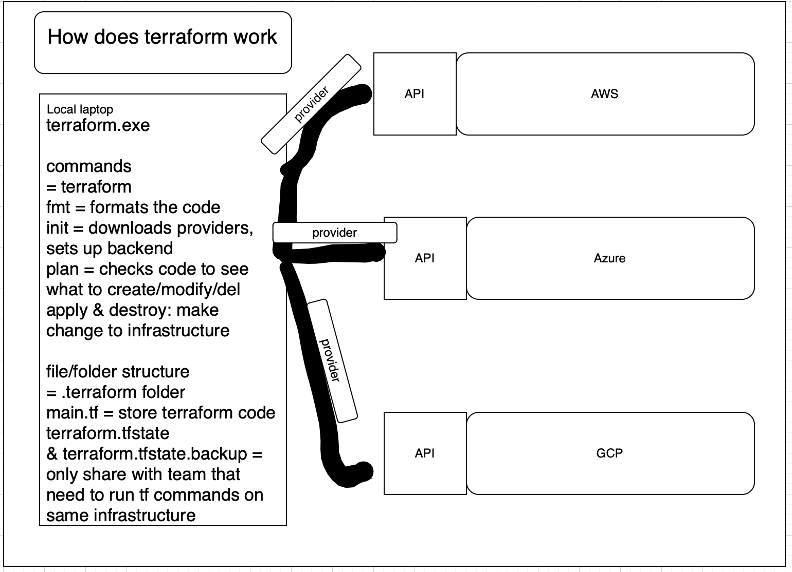
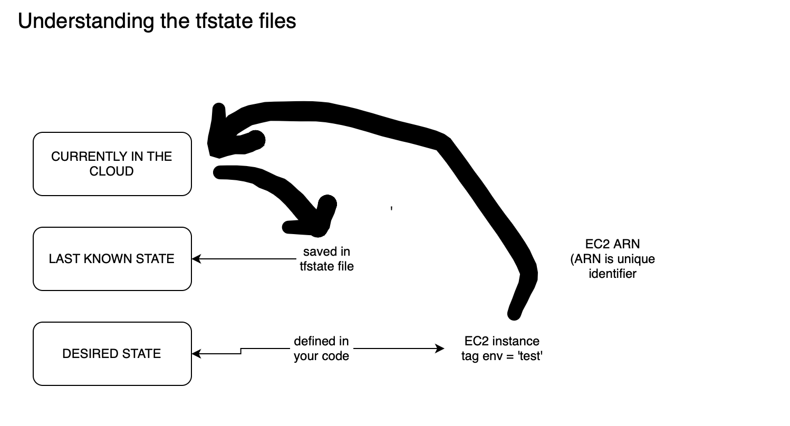

- [installing terraform](#installing-terraform)
  - [what is terraform](#what-is-terraform)
    - [why use terraform?](#why-use-terraform)
    - [alternatives to terraform](#alternatives-to-terraform)
    - [In IaC, what is orchestration?](#in-iac-what-is-orchestration)
    - [how does terraform act as a orchestrator?](#how-does-terraform-act-as-a-orchestrator)
    - [best practice supplying AWS credentials to terraform](#best-practice-supplying-aws-credentials-to-terraform)
    - [why use terraform for different environments (production, testing, etc)](#why-use-terraform-for-different-environments-production-testing-etc)
    - [what is it used for?](#what-is-it-used-for)
    - [how does it work?](#how-does-it-work)
    - [what is terraform.lock.hcl](#what-is-terraformlockhcl)
    - [understanding the tfstate files](#understanding-the-tfstate-files)


## What problem needs solving?
- At the moment, we are still "provisioning" servers

- What is "provisioning" servers?
  - The process of setting up and configuring servers

## What have we automated?
- VMs
  - Creation of the VMs? no
  - Creation of the infrastructure they live in? no
  - Setup and configuring of the software on them? Yes, how?
    - Bash scripting
    - user data
    - images
- What if we codify all of it so that:
  - we do NOT define how to get it done (imperative, like our Bash scripts)
  - we define the desired state/outcome (and the tool takes care of working out the steps to get us there)

## Solving the problem

Infrastructure as Code (IaC) can do all the provisioning of:
- the infrastructure itself (the servers & the network & extra resources)
- configuring the servers i.e. installing the correct software and configuring the settings
... in an automated and repeatable manner using code

The process typically involves:
1. creating the server instance
2. configuring OS and sofware
3. deploy application
4. configuring monitoring and logging

<br>

### What is IaC?

- A way to manage and provision computers through machine-readable definitions of infrastructure and software configurations

### Benefits of IaC?

- Speed and simplicity
  - Less manually checking that everything ended up the way it should be, because you are describing the end state required and trusting the tool to work how to get done
- Consistency & accuracy
  - Less risk of human error
- Version control
- Scalability
  - Easily re-use code, easily scale or duplicate infrastructure

### When/where to use IaC

- Question is: When do you automate something? Ask yourself: Is it worth the invest in time?
- Often used in CI/CD pipelines

### What are the tools available for IaC?

2 types of tools
- Configuration management tools (about configuring software)
  - Chef
  - Puppet
  - Ansible
- Orchestration tools (orchestration of infrastructure)
  - CloudFormation (AWS)
  - ARM/Bicep templates (Azure)
  - Terraform
  - Ansible (can also do this, but not primarily designed for this)


# installing terraform

1. create a new repo for IaC, infrastructure as code.

2. '/bin/bash -c "$(curl -fsSL https://raw.githubusercontent.com/Homebrew/install/HEAD/install.sh)"' 
- this installs brew

3. 'brew tap hashicorp/tap
   brew install hashicorp/tap/terraform'
- uses brew to install terraform

4. 'terraform -version'
- output: Terraform v1.15.2 on darwin_arm64

## what is terraform

- define, create, and manage infrastructure using code
- describe servers, databases and networks in a file and terraform builds them
- works with cloud platforms, containers, networkings, databases
- you write the code, terraform creates a plan and applies the changes

### why use terraform?
- declarative - say what you want, not how to do it
- easy to use
- sort of open source
  - starteed using business source license
  - cannot be used to create a competing commercial product
  - some organisations using OpenTofu instead (open source)
    - OpenTofu aims to be a drop in replacement
- cloud agnostic
  - can deploy to different cloud providers
    - use different provider (like a plugin) to interface with different cloud providers
    - each cloud provider maintains its own provider
- expressive and extendable
  - expressive: types of things you can put into the language (for loops, templates, variables)
  - extendable: provide different plugins and terraform caters to them (using different providers to manage resources)

### alternatives to terraform
- Pulumi (not declarative)
- AWS cloudformation, azure arm templates, GCP deployment manager

### In IaC, what is orchestration?
- process of automating and managing the entire life cycle of infrastructure resources 
- resources can be spread to many different cloud platofrms in the same terraform file

### how does terraform act as a orchestrator?
- co- ordinatiing the piece of infrastructure to work together
- includes 
  - setting things up/destroying in the right order
  - make sure things are connected properly

To do this, it relies on understanding the dependencies between resources


### best practice supplying AWS credentials to terraform

- what is the order in whih terraform looks up aws credentials
   1. env variables: access key and private access key
   2. terraform variables: 
   ```
   provider "aws" {
      access_key = "your_access_key"
      secret_ley = "your-secret-key"
   }
   (temporarily set them through a key vault when needed)
   ```

- ALWAYS AVOID HARD-CODING CREDENTIALS

   3. AWS CLI shared credentials file (aws configure)
   4. EC2 instance metadata: through IAM role permissions

### why use terraform for different environments (production, testing, etc)

- production
  - easily create a larger- scale or more scalable version of infrastructure

- Dev and testing envs:
  - easily spin up infrastructure for testing/dev that mirrors production 
    - easily tear it down when not needed
    - saving costs

### what is it used for?
- IaC type of tool: orchestration
- infrastructural provisioning tool
- manage cloud resources
- different to configuration management tools like like ansible which deploy software onto servers
- sees infrastructure as immutable
- uses code written in HCL (hasicorp configuration language), balance between human and computer readable
  - converted 1:1 to json

### how does it work?


### what is terraform.lock.hcl
- dependency lock file for providers, ensures same version of provider is shared across users
- security, integrity, reproducibility, team consistency

### understanding the tfstate files

